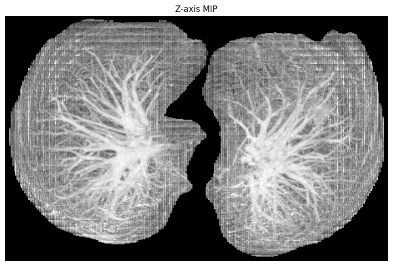
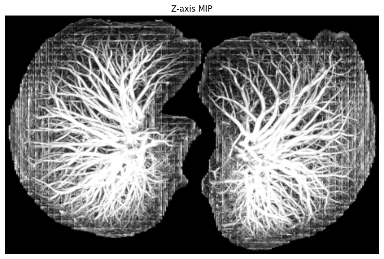

# Jerman_Hessian_Filter_3D_pytorch
Pytorch implementation of 3D vesselness filter for medical images using the Jerman algorithm, a type of Hessian filter. 

> T. Jerman, F. Pernus, B. Likar, Z. Spiclin, "Enhancement of Vascular Structures in 3D and 2D Angiographic Images", IEEE Transactions on Medical Imaging, 35(9), p. 2107-2118 (2016), doi={10.1109/TMI.2016.2550102}

The original implementation was in matlab. This is a pytorch implementation of the 3D vesselness filter, which can be run on a GPU. 

## File organization 

- src/hessian_filter_gpu.py contains the main function "vesselness3D" which can be used to run the Jerman filter on an input 3D image. 
- src/run.py contains an example function that utilizes "vesselness3D". See the function "run_hessian_vesselness_multiscale_python_gpu" for this example. 

## Example results 

**Original (lung-segmented MIP)** — Maximum intensity projection of a chest CT scan after segmenting the lung region.

**Hessian-filtered MIP** — Same volume after applying the 3D Jerman Hessian vesselness filter to the lung-segmented image, then removing large connected components along the lung surface (typically ribs and other chest-wall structures).

